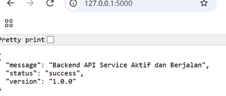
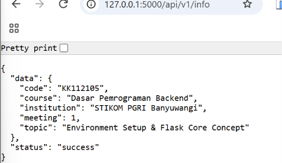
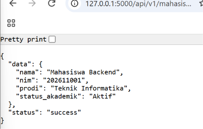
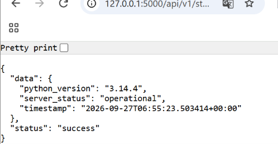

# Proyek Banckend (Flask)
Proyek ini dibuat untuk memenuhi tugas dan praktikum mandiri mata kuliah Dasar Pemrograman Backend di STIKOM PGRI Banyuwangi. Proyek ini menggunakan framework Python Flask untuk membangun RESTful API sederhana dengan format respons JSON yang konsisten.

---
## Daftar Endpoint API
Berikut adalah dokumentasi rute endpoint yang tersedia pada layanan backend ini:

### 1. Root / Health Check Service
* **URL:** `/`
* **Method:** `GET`
* **Deskripsi:** Endpoint utama untuk memeriksa apakah layanan API server aktif dan berjalan dengan baik.
* **Contoh Payload (JSON):**
  ```json
  {
    "status": "success",
    "message": "Backend API Service Aktif dan Berjalan",
    "version": "1.0.0"
  }
  ```
ini hasilnya:
 


### 2. Informasi Akademik & Perkuliahan
* **URL:** `/api/v1/info`
* **Method:** `GET`
* **Deskripsi:** Mengembalikan informasi terkait mata kuliah, kode kelas, institusi, dan topik pertemuan.
* **Contoh Payload (JSON):**
  ```json
  {
  "status": "success",
  "data": {
    "course": "Dasar Pemrograman Backend",
    "code": "KK112105",
    "institution": "STIKOM PGRI Banyuwangi",
    "meeting": 1,
    "topic": "Environment Setup & Flask Core Concept"
  }
  }
  ``` 
  ini hasilnya:
  


### 3. Profil Data Mahasiswa
* **URL:** `/api/v1/mahasiswa`
* **Method:** `GET`
* **Deskripsi:** 
Mengembalikan data dummy profil mahasiswa yang mengakses atau mengelola layanan backend.
* **Contoh Payload (JSON):**
  ```json
  {
  "status": "success",
  "data": {
    "nim": "202611001",
    "nama": "Mahasiswa Backend",
    "prodi": "Teknik Informatika",
    "status_akademik": "Aktif"
  }
  }
  ```
  ini hasilnya:
  


### 4. Status Operasional Server
* **URL:** `/api/v1/status`
* **Method:** `GET`
* **Deskripsi:** 
Mengembalikan status operasional server secara real-time, lengkap dengan waktu sistem (timestamp berformat ISO) dan versi runtime python yang digunakan.
* **Contoh Payload (JSON):**
  ```json
  {
  "status": "success",
  "data": {
    "server_status": "operational",
    "timestamp": "2026-09-25T21:22:10Z",
    "python_version": "3.11.0"
  }
  }
  ```
  ini hasilnya:
  
